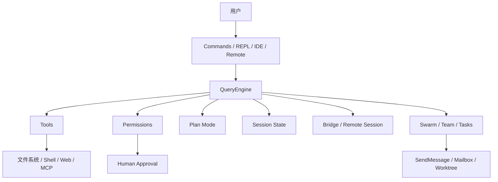

# Claude Code 源码分析

> 这不是 Claude Code 的官方开源仓库，而是一份可用于**架构学习、工程分析与防御性安全研究**的源码快照。
>
> 如果你想真正看懂：一个成熟的 AI 编程助手，到底是怎么把 **CLI、工具调用、权限系统、计划模式、IDE Bridge、多 Agent 协作、远程会话和持久记忆** 拼成一个完整系统的，这个仓库非常值得读。

---

## 这份仓库适合谁看？

### 如果你是程序员
你可以把它当成一份非常稀缺的真实样本，研究：

- Agentic CLI 是怎么分层的
- Tool Use 如何落到工程系统里
- QueryEngine 如何组织消息、工具、权限和上下文
- 多 Agent 团队能力如何真正落地
- 为什么 Claude Code 不只是“终端里的聊天框”

### 如果你不是程序员，但对 AI 工具感兴趣
你也可以把它理解成：

- 一个“会写代码的 AI”背后，其实不是一个模型，而是一整套系统
- 这套系统要管理文件、命令、搜索、网页、权限、团队协作和远程连接
- 它更像一台“智能工程工作台”，而不是一个普通对话机器人

---

## 先给结论：Claude Code 的核心思想是什么？

一句话说，它做的不是“让模型回答问题”，而是：

> **把模型放进一个被严格组织、可控、可扩展、可协作的工程执行环境里。**

这个环境至少包含六层：

1. **入口层**：CLI、slash commands、REPL、远程入口
2. **调度层**：QueryEngine 负责消息、工具循环、上下文与状态
3. **能力层**：Read / Edit / Bash / Agent / Skill / MCP 等工具
4. **控制层**：权限、Plan Mode、Worktree、任务系统
5. **协作层**：Bridge、Remote Session、Swarm、Team、SendMessage
6. **外部连接层**：文件系统、Shell、Web、MCP、IDE、认证与遥测

---

## 一张图看懂整体架构

```text
┌──────────────────────────────────────────────────────────────┐
│                         用户 / 外部入口                      │
│   Terminal REPL   Slash Commands   IDE Bridge   Remote UI   │
└──────────────────────────────────────────────────────────────┘
                              │
                              ▼
┌──────────────────────────────────────────────────────────────┐
│                      入口与会话编排层                        │
│      src/entrypoints/cli.tsx   src/main.tsx   commands.ts   │
└──────────────────────────────────────────────────────────────┘
                              │
                              ▼
┌──────────────────────────────────────────────────────────────┐
│                        QueryEngine 层                        │
│   消息生命周期 / 工具调用循环 / 上下文构造 / 成本统计 / 状态  │
│                     核心文件：src/QueryEngine.ts             │
└──────────────────────────────────────────────────────────────┘
                              │
               ┌──────────────┼──────────────┐
               ▼              ▼              ▼
┌──────────────────┐ ┌──────────────────┐ ┌──────────────────┐
│    Tools 层      │ │   Control 层     │ │ Collaboration 层 │
│ Read/Edit/Bash   │ │ Permissions      │ │ Bridge / Remote  │
│ Agent/Skill/MCP  │ │ Plan Mode        │ │ Swarm / Team     │
│ Web/LSP/Tasks    │ │ Worktree/Tasks   │ │ Mailbox/Session  │
└──────────────────┘ └──────────────────┘ └──────────────────┘
               │              │              │
               └──────────────┴──────────────┘
                              ▼
┌──────────────────────────────────────────────────────────────┐
│                       外部系统与真实世界                      │
│   文件系统 / Shell / Git / Web / MCP Servers / IDE / Auth   │
└──────────────────────────────────────────────────────────────┘
```

---

## 它为什么值得研究？

### 1. 它不是“模型 + 命令行皮肤”
从 `src/entrypoints/cli.tsx`、`src/main.tsx`、`src/commands.ts`、`src/tools.ts`、`src/QueryEngine.ts` 这条链路往下看，会发现 Claude Code 的重点从来都不只是“接 API”。

它真正解决的是：

- 用户如何发起任务
- 模型如何决定下一步
- 工具如何被安全调用
- 权限如何被控制
- 状态如何跨多轮保留
- 多个代理如何协作
- 远程端与本地端如何连在一起

### 2. 它把“先想清楚再执行”产品化了
Plan Mode 不是文案建议，而是系统能力。复杂任务并不会默认直接改代码，而是可以先进入规划阶段，探索代码、生成计划、等待批准、再继续执行。

这件事背后体现的是一种很成熟的产品哲学：

> **先建立流程约束，再放大模型能力。**

### 3. 它把“多 Agent”做成了真实协作系统
很多产品提“多 Agent”时，指的是 prompt 里虚构几个角色。

但从 `src/tools/TeamCreateTool/**`、`src/coordinator/**`、`src/utils/swarm/**`、`src/utils/teammateMailbox.ts` 可以看出来，Claude Code 的多 Agent 是有真实底层支撑的：

- 团队配置
- 任务分配
- agent 间消息
- leader 审批
- 文件邮箱
- worktree 隔离
- 会话恢复

这已经不是“多人格”，而是接近真正的协作系统。

---

## 推荐阅读入口

### 给程序员的阅读路径
1. 先看入口：[`src/entrypoints/cli.tsx`](src/entrypoints/cli.tsx)
2. 再看命令与工具注册：[`src/commands.ts`](src/commands.ts)、[`src/tools.ts`](src/tools.ts)
3. 再看核心引擎：[`src/QueryEngine.ts`](src/QueryEngine.ts)
4. 再看运行时协议：[`src/Tool.ts`](src/Tool.ts)
5. 最后按主题继续深挖 Bridge、Swarm、Permissions、Plan Mode

### 给普通读者的阅读路径
1. 先看下面这几篇文档，建立整体认知
2. 不必一开始就钻进超长 TypeScript 文件
3. 先理解思想，再去看实现

---

## 文档导航

这次我把内容做了分层：**README 只讲框架，细节拆到专题文档。**

### 1. 总体架构
- [整体架构总览](docs/architecture-overview.md)

### 2. QueryEngine、命令与工具系统
- [QueryEngine 与工具系统详解](docs/query-and-tools.md)

### 3. Bridge 与远程会话
- [Bridge、Remote 与跨端连接](docs/bridge-and-remote.md)

### 4. Swarm、Team、权限与计划模式
- [多 Agent、权限系统与 Plan Mode](docs/swarm-and-permissions.md)

### 5. 阅读路径与关键文件索引
- [源码阅读指南](docs/reading-guide.md)

### 6. 致谢与贡献说明
- [致谢与贡献说明](docs/contributors-and-acknowledgements.md)

---

## 再给一张图：系统控制关系



如果你只想记住一件事，那就是：

> Claude Code 的关键，不是“能调多少工具”，而是“模型、工具、权限、协作和会话状态是怎么被组织成一个整体的”。

---

## 当前快照的边界

这份仓库是**源码快照**，不是完整的官方开发仓库。

当前根目录只有：

```text
README.md
src/
```

也就是说，这里更适合：

- 架构分析
- 源码阅读
- 系统分层理解
- 供应链与发布安全研究

而不是直接构建运行完整产品。

---

## 读这个仓库时，最值得抓住的五个问题

1. 为什么 Claude Code 要把命令系统和工具系统分开？
2. QueryEngine 为什么是全系统的中心？
3. 权限为什么不是附加功能，而是核心运行机制？
4. 多 Agent 为什么必须依赖任务、消息、worktree 和审批流？
5. Bridge 为什么说明它本质上不是一个“纯本地 CLI”？

如果你沿着这五个问题读，会比按目录盲看更快建立整体理解。

---

## 致谢

这个仓库的整理与分析，建立在公开可见的研究线索、源码快照与社区讨论基础上。

感谢那些让这份工程样本得以被认真研究的人，也感谢所有愿意把注意力放回到**系统设计本身**的人——因为真正值得学习的，不是“看到了源码”这件事，而是源码背后的设计思想。

另外，感谢 **SII-zyj** 在这份仓库整理、讨论与分析思路补充中的贡献。

---

## 声明

- 本仓库不是 Anthropic 官方仓库
- 原始 Claude Code 相关权利归 **Anthropic** 所有
- 本仓库内容仅用于**教育、架构分析与防御性安全研究**
- 请不要将这里的内容用于恶意用途

---

## 最后一句

如果你把这份仓库当成一份“泄露材料”，它的价值很快就结束了。

但如果你把它当成一份**现代 AI 工程系统的真实切片**，那它会非常值得反复阅读。